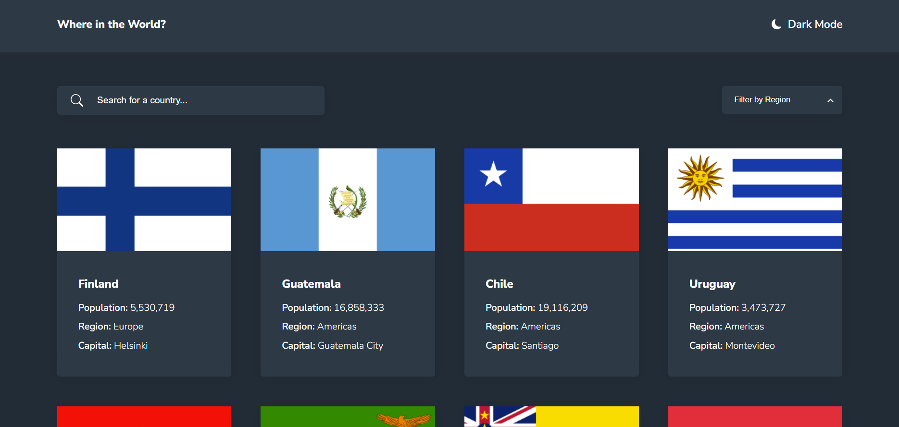

# Frontend Mentor - REST Countries API with color theme switcher solution

This is a solution to the [REST Countries API with color theme switcher challenge on Frontend Mentor](https://www.frontendmentor.io/challenges/rest-countries-api-with-color-theme-switcher-5cacc469fec04111f7b848ca). Frontend Mentor challenges help improve your coding skills by building realistic projects.

## Table of contents

- [Overview](#overview)
  - [The challenge](#the-challenge)
  - [Screenshot](#screenshot)
  - [Links](#links)
- [My process](#my-process)
  - [Built with](#built-with)
  - [What I learned](#what-i-learned)
  - [Continued development](#continued-development)
- [Author](#author)

## Overview

### The challenge

Users should be able to:

- See all countries from the API on the homepage.
- Search for a country using an `input` field.
- Filter countries by region.
- Click on a country to see more.detailed information on a separate page
- Click through to the border countries on the detail page.
- Toggle the color scheme between light and dark mode.

### Screenshot



### Links

(links to be added)

- Solution URL: [Add solution URL here](https://your-solution-url.com)
- Live Site URL: [Add live site URL here](https://your-live-site-url.com)

## My process

### Built with

- Semantic HTML5 markup

- CSS custom properties

- [SASS](https://sass-lang.com/) (Mixins & media queries)

- Flexbox && CSS Grid

- Mobile-first workflow

- [React](https://reactjs.org/) - JS library to help build a component based User Interface.

- [React-Router-6](https://reactrouter.com/en/v6.3.0) A library to help create internal navigation thoughout a application or website.

- [Redux-toolkit](https://redux-toolkit.js.org/) A third party tool, to help build and handle state management.

- [React-Toastify](https://fkhadra.github.io/react-toastify/introduction) A library to create and display UI notifications messages.

- [Axios](https://axios-http.com/) - A Library to help handle API calls and Error handling.

### What I learned

In this project I learnt more about react router and the different ways it could be used. For example when selecting a certain country from a list, we can use the "Link" component to pass in an id from that country into the URL of the page and then use that id, via the "useParams" hook, to fetch more specific information about that country in the single page. Not only that but we can also pass in different bits of data into the "Link" component and then get this data, via the "useLocation", So we can use it in the page we have routed to. The "useLocation" hook and also be used for other things like getting the path name of the current page.

```js
  {allCountries.length > 0 &&
      countries.map((temp, i) => {
        const { borders, ccn3 } = temp;
        return (
          <Link
            className="countries-link-style"
            to={`/country/${ccn3}`}
            state={{ borders }}
            key={i}>
            <CountryBox {...temp} />
          </Link>
        );
      });
  }
```

```
import {useParams, useLocation} from "react-router-dom";

const {code} = useParams()
const location = useLocation()
const {borders} = location.state
const path = location.pathname
```
In order to stick to the design as close as possible, with 8 countries showing at a time, I learned how to implement a "more countries" feature button that would add another 8 countries to be displayed everytime it is clicked. To do this I used a similar concept to adding pagination where I have an array of items and split them up into an array of arrays, with the arrays having the amount of items I want to display at one time. I then display the first array and then add another to it each time the button is clicked, untill all the arrays/countries have been added.

Creating the array of arrays:

"checkForFilter()" returns the full array of countries.
```
  const itemsPerScroll = () => {
    const countriesShownAtOnce = 8;
    const pages = Math.ceil(checkForFilter().length / countriesShownAtOnce);
    const newScroll = Array.from({ length: pages }, (_, i) => {
      const start = i * countriesShownAtOnce;
      return checkForFilter().slice(start, start + countriesShownAtOnce);
    });
    const initialCountries = newScroll[0];
    setCountries(initialCountries);
    setAllCountries(newScroll);
  };
```
Then we start adding the arrays together:
```
  const addNewCountries = () => {
    if (allCountriesData) {
      if (countriesIndex > countries.length) return;
      dispatch(changeCountriesIndex("inc"));
      setCountries((country) => {
        return [country, ...allCountries[countriesIndex + 1]].flat();
      });
    }
  };
```

### Continued development

I used Redux-toolkit to controll the state of this application and I thought one feature/slice would be enough but it ended up growing bigger than I thought it would, so in my future projects, I will definitely be splitting up the state into multiple different slices for the features. This way the state will be much more clean, orginised, readable and easier to manage.

## Author

- Website - [David Henery](https://www.djhwebdevelopment.com)
- Frontend Mentor - [@David-Henery4](https://www.frontendmentor.io/profile/David-Henery4)
- LinkedIn - [David Henery](https://www.linkedin.com/in/david-henery-725458241)


